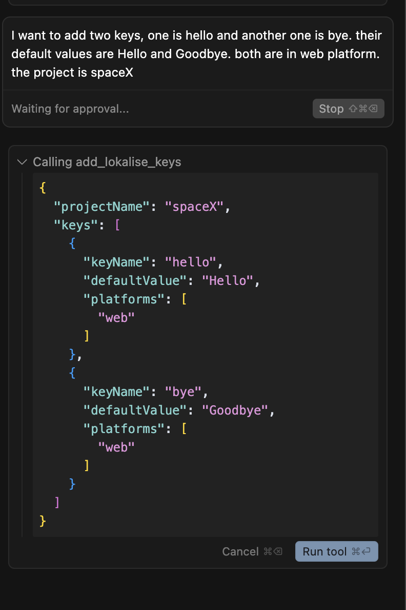

# Lokalise MCP Tool

A Minimal Command-line Program (MCP) server for managing translation keys in your Lokalise projects, designed for integration with [Cursor](https://www.cursor.so/) or standalone use.

## 📦 Installation

```bash
# For MCP usage (global installation)
npm install -g @tobiashornbogen/lokalise-mcp-server

# For library usage (project dependency)
npm install @tobiashornbogen/lokalise-mcp-server
```

**NPM Package**: https://www.npmjs.com/package/@tobiashornbogen/lokalise-mcp-server

---

## 🖼️ MCP Flow Diagram


_This diagram illustrates the Model Context Protocol (MCP) flow between Cursor, your MCP server, and Lokalise._

## ⚡️ Usage (Quick Start with Cursor MCP)

### **Option 1: NPM Package (Recommended)**

🛠️ Add this to your `mcp.json` (or configure via Cursor UI):

```json
{
  "mcpServers": {
    "lokalise": {
      "command": "npx",
      "args": ["-y", "@tobiashornbogen/lokalise-mcp-server"],
      "env": {
        "LOKALISE_API_KEY": "your_actual_api_key"
      }
    }
  }
}
```

3. 🔄 **Reload Window.** It will automatically use the npm package.

### **Option 2: Docker (Alternative)**

**No need to run Docker or Podman manually!**

1. 🐳 Make sure Docker or Podman is installed and running.
2. 🛠️ Add this to your `mcp.json` (or configure via Cursor UI):

   ```json
   {
     "mcpServers": {
       "lokalise": {
         "command": "docker", // podman
         "args": [
           "run",
           "--rm",
           "-i",
           "-e",
           "LOKALISE_API_KEY",
           "tobiashornbogen/mcp-lokalise:latest"
         ],
         "env": {
           "LOKALISE_API_KEY": "your_actual_api_key"
         }
       }
     }
   }
   ```

   - You can use `podman` instead of `docker` if you prefer.
   - Cursor will automatically pull and run the image as needed.

3. 🔄 **Restart Cursor.** It will handle everything for you.

---

## 🔧 Available MCP Tools

This server provides **5 powerful tools** for comprehensive Lokalise translation management:

### 1. **🆕 Add Translation Keys** (`add_lokalise_keys`)

Create new translation keys with default values and platform assignments.

**Example usage in Cursor:**

> "Add two keys to my SpaceX project: 'welcome_message' with default 'Welcome!' for web platform, and 'goodbye_text' with default 'Goodbye!' for all platforms"

### 2. **✏️ Update Existing Keys** (`update_lokalise_keys`)

Update existing translation keys with new properties, platforms, descriptions, tags, and translations in multiple languages.

**Example usage in Cursor:**

> "Update the 'welcome_message' key in my SpaceX project: change description to 'Main welcome text', add 'frontend' tag, and set German translation to 'Willkommen!'"

### 3. **🗑️ Delete Keys** (`delete_lokalise_keys`)

Remove translation keys from your Lokalise project.

**Example usage in Cursor:**

> "Delete the keys 'old_welcome' and 'deprecated_text' from my SpaceX project"

### 4. **🌍 Manage Multi-Language Translations** (`manage_lokalise_translations`)

Update translations for existing keys in multiple languages with support for German and English (expandable to other languages).

**Example usage in Cursor:**

> "For my SpaceX project, update 'hello_world' key with English 'Hello World!' and German 'Hallo Welt!', and mark them as reviewed"

### 5. **🔍 Search & Filter Keys** (`search_lokalise_keys`) ⭐ **NEW!**

Find translation keys based on various criteria instead of exact names. Supports complex filtering by name patterns, tags, platforms, translation status, and more.

**Example usage in Cursor:**

> "Find all keys with 'error' in the name in my SpaceX project"
> "Show me untranslated keys in German for SpaceX project"
> "Find keys tagged with 'urgent' that need review in my SpaceX project"
> "Show keys created this week that are available on iOS platform"

**Advanced Search Criteria:**

- **Name Patterns**: Partial or exact key name matching
- **Tags**: Filter by required tags (must have all specified tags)
- **Platforms**: Filter by platform availability (web, ios, android, other)
- **Translation Status**: Find translated, untranslated, fuzzy, or reviewed keys
- **Languages**: Check status in specific languages (German, English)
- **Descriptions**: Keys with/without descriptions or description patterns
- **Dates**: Filter by creation date ranges
- **Limit**: Control number of results (1-200)

---

## 📝 How to Use in Cursor

### **Adding Keys**

- **projectName** (required): The name of your Lokalise project (e.g., `SpaceX`).
- **keys** (required): An array of objects, each with:
  - **keyName** (required): The translation key (e.g., `hello`)
  - **defaultValue** (optional): The default translation value (e.g., `Hello`)
  - **platforms** (optional): The platforms this key applies to (e.g., `web`, `ios`)
  - **description** (optional): Description for the key
  - **tags** (optional): Tags for organization

### **Updating Keys**

- **projectName** (required): The name of your Lokalise project
- **keys** (required): Array of objects with:
  - **keyName** (required): Name of existing key to update
  - **platforms** (optional): New platform assignments
  - **description** (optional): New description
  - **tags** (optional): New tags
  - **translations** (optional): Object with language codes (en, de) and their translations

### **Deleting Keys**

- **projectName** (required): The name of your Lokalise project
- **keys** (required): Array of objects with:
  - **keyName** (required): Name of key to delete

### **Managing Translations**

- **projectName** (required): The name of your Lokalise project
- **translations** (required): Array of objects with:
  - **keyName** (required): Name of existing key
  - **translations** (required): Object with language codes and translations
  - **markAsReviewed** (optional): Whether to mark translations as reviewed

**Multi-Language Support:**
Currently supports **German (`de`)** and **English (`en`)** with the infrastructure to easily add more languages.

**Example:**

> I want to add two keys, one is hello and another one is bye. their default values are Hello and Goodbye. both are in web platform. the project is spaceX



---

## 🌟 Key Features

### **🔄 Full CRUD Operations**

- ✅ **Create** new translation keys with default values
- ✅ **Read** existing keys (used internally for updates/deletes)
- ✅ **Update** key properties and translations
- ✅ **Delete** unwanted keys

### **🔍 Advanced Search & Discovery** ⭐ **NEW!**

- ✅ **Pattern-based search** - Find keys by partial name matches
- ✅ **Multi-criteria filtering** - Combine tags, platforms, status, dates
- ✅ **Translation status analysis** - Find untranslated, fuzzy, or reviewed keys
- ✅ **Smart project exploration** - Discover keys across large projects efficiently
- ✅ **Natural language queries** - "Find error messages needing German translation"

### **🌍 Multi-Language Translation Management**

- ✅ Support for **German** and **English** translations
- ✅ Update translations for existing keys
- ✅ Mark translations as reviewed
- ✅ Extensible architecture for additional languages

### **🎯 Platform-Specific Targeting**

- ✅ Assign keys to specific platforms: `web`, `ios`, `android`, `other`
- ✅ Update platform assignments for existing keys
- ✅ Smart defaults (all platforms if none specified)

### **🏷️ Advanced Organization**

- ✅ Add descriptions and tags to keys
- ✅ Update metadata for existing keys
- ✅ Bulk operations for efficiency

### **⚡️ Intelligent Key Management**

- ✅ Find keys by name across large projects
- ✅ Comprehensive error handling and validation
- ✅ Bulk operations with detailed feedback

---

## 📁 Project Files

**TypeScript Source Files (src/):**

- **src/mcp-server.ts**: The main MCP server entry point for Cursor integration.
- **src/mcp.ts**: Shared logic for interacting with the Lokalise API (used by the server).
- **src/lokalise-client.ts**: Extended API client with full CRUD operations.
- **src/types.ts**: Comprehensive TypeScript definitions for all operations.
- **src/server.ts**: (Optional) HTTP server version (not required for Cursor).
- **src/add-key.ts**: (Optional) CLI tool for adding a key interactively (not required for Cursor).

**Compiled JavaScript Files (dist/):**

- **dist/mcp-server.js**: Compiled MCP server.
- **dist/mcp.js**: Compiled API logic.
- **dist/lokalise-client.js**: Compiled API client.
- **dist/server.js**: Compiled HTTP server.
- **dist/add-key.js**: Compiled CLI tool.

**Other Files:**

- **tsconfig.json**: TypeScript configuration.
- **Dockerfile**: For building the Docker image of the MCP server.
- **package.json**: Project dependencies and scripts.
- **README.md**: This documentation file.

---

## 🛠️ Setup (For Local Development or Customization)

### 1. 📥 Clone the Repository

```sh
git clone https://github.com/tobiashornbogen/mcp-lokalise.git
cd mcp-lokalise
```

### 2. 📦 Install Dependencies

```sh
npm install
```

### 3. 🔨 Build the Project

```sh
npm run build
```

### 4. 🔑 Set Your Lokalise API Key

In your MCP config (recommended for Cursor)

```json
{
  "mcpServers": {
    "lokalise": {
      "command": "node",
      "args": ["{directory-of-the-project}/dist/mcp-server.js"],
      "env": {
        "LOKALISE_API_KEY": "your_actual_api_key"
      }
    }
  }
}
```

---

## Available Scripts

- `npm run build` - Compile TypeScript to JavaScript
- `npm run dev` - Run the MCP server in development mode with tsx
- `npm run server` - Run the HTTP server in development mode with tsx
- `npm run add-key` - Run the CLI tool in development mode with tsx
- `npm start` - Run the compiled MCP server from dist/

### Requirements

- Node.js 22+ recommended
- TypeScript 5.8+
- MCP protocol via [@modelcontextprotocol/sdk](https://www.npmjs.com/package/@modelcontextprotocol/sdk)

---

## License

MIT
